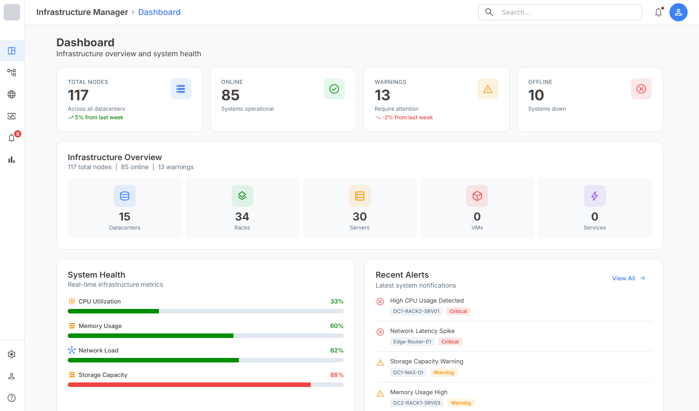
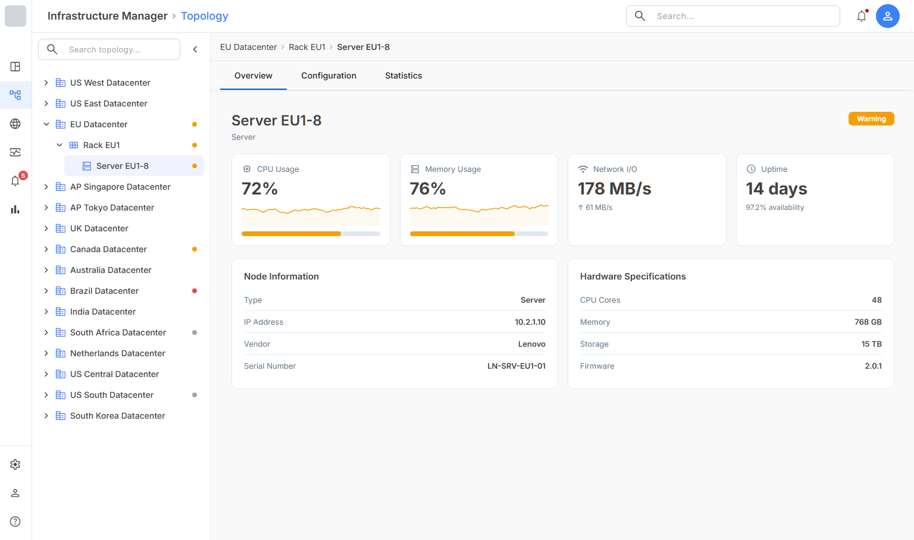
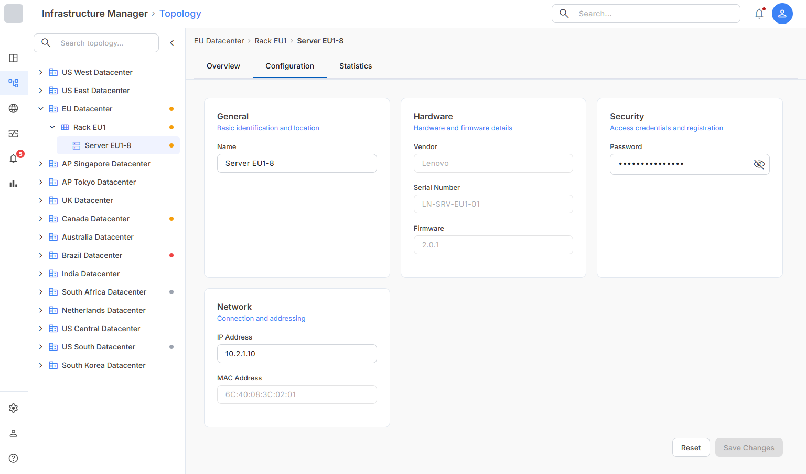
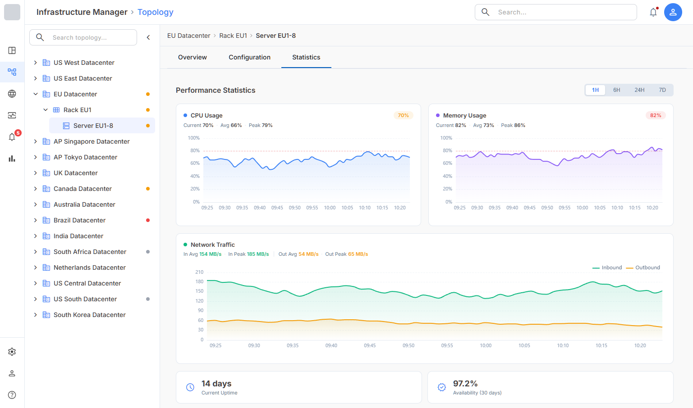
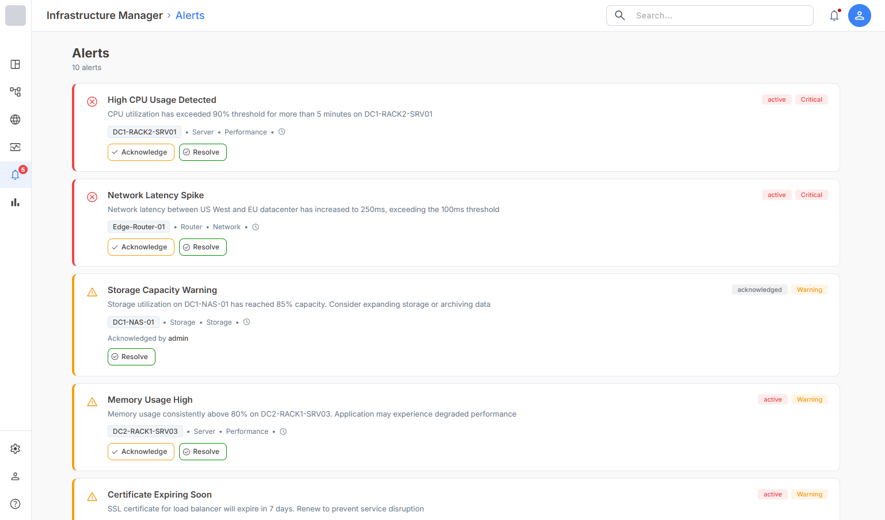

# InfraWatch

A demo Angular application simulating an enterprise monitoring platform, providing a centralized view of system health, device topology, and performance metrics. Built to showcase complex UI architecture and data visualization patterns.

---

## Live Demo

[https://infra-watch-eta.vercel.app](https://infra-watch-eta.vercel.app)

---

## Screenshots

### Dashboard


### Topology Overview


### Topology Configuration


### Topology Statistics


### Alerts


---

## Features

**Dashboard** — system KPIs (total nodes, online, warnings, offline), real-time health metrics (CPU, memory, network, storage), infrastructure overview, and recent alerts

**Topology** — hierarchical tree navigation (datacenters → racks → servers → VMs → services) with node detail tabs:
- Overview — status, hardware specs, and CPU/memory sparklines
- Configuration — dynamic form adapting to node type, with IP and MAC address validation
- Statistics — time-range selector (1H / 6H / 24H / 7D) with CPU, memory, and network charts

**Alerts** — full alert list with severity indicators and acknowledge/resolve actions

---

## Tech Stack

- Angular 21 (standalone components)
- Signals-based state management
- RxJS
- TypeScript
- Angular Material (customized design system)
- ECharts (data visualization )

---

## Architecture

Application structured using feature-based architecture:

```
src/app/
├── core/          # Singleton services and global state
├── features/      # Domain-driven feature modules
│   ├── dashboard/
│   ├── monitoring/
│   ├── topology/  # Hierarchical navigation and node views
│   ├── alerts/
│   ├── network/
│   └── reports/
├── shared/        # Reusable components, models, utilities
└── layout/        # Application shell (header, sidebar)
```

---

## Data & Backend

Uses mock data for demonstration purposes; backend integration planned via Node.js (NestJS).

---

## Getting Started

```bash
npm install
ng serve
```

Then open: `http://localhost:4200`

---

## Status

Work in progress — additional features and backend integration are planned.
